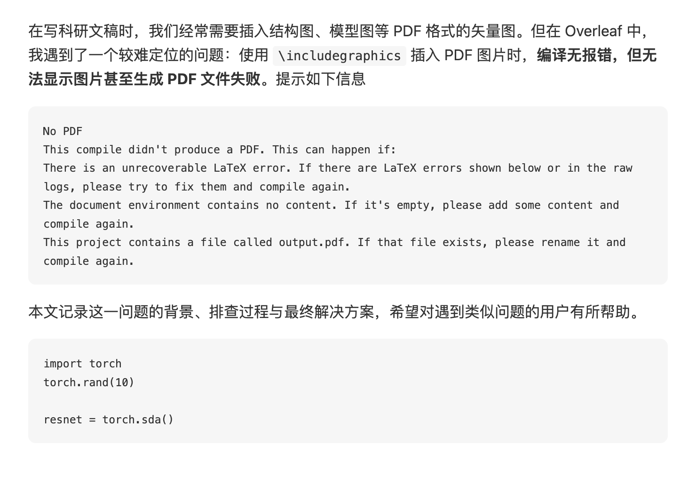
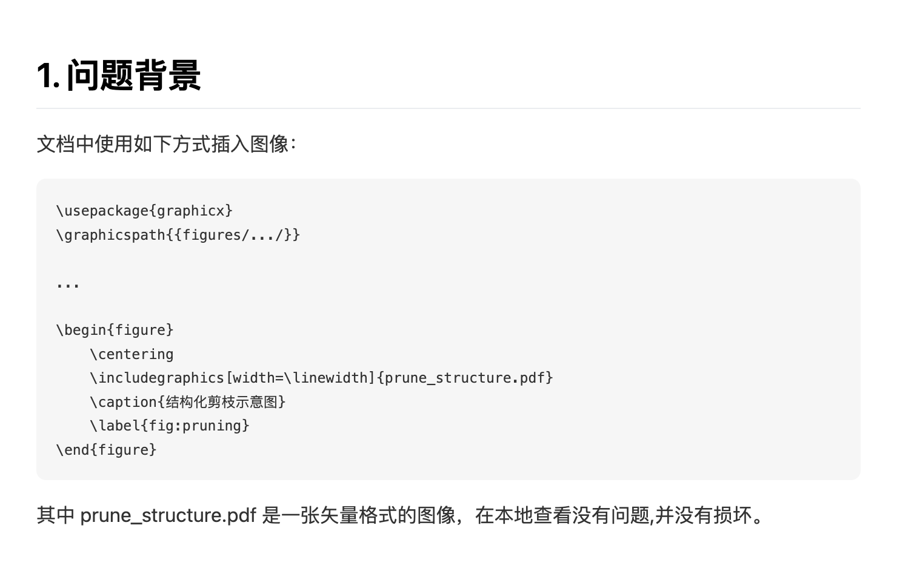
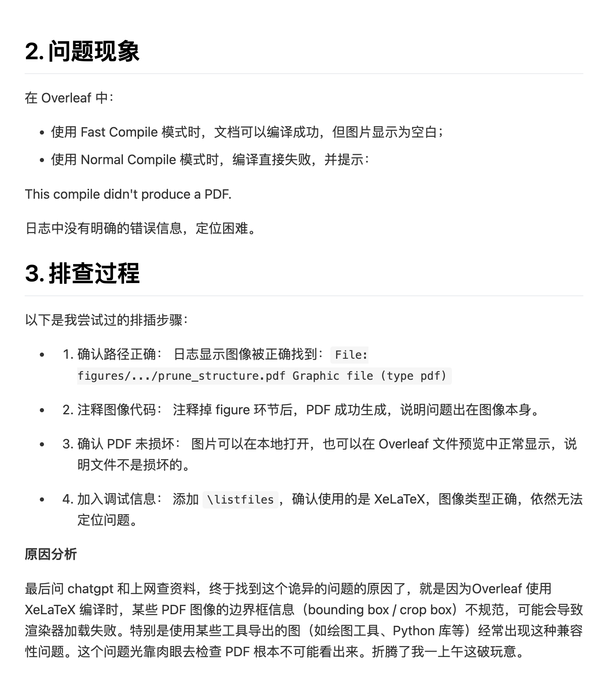
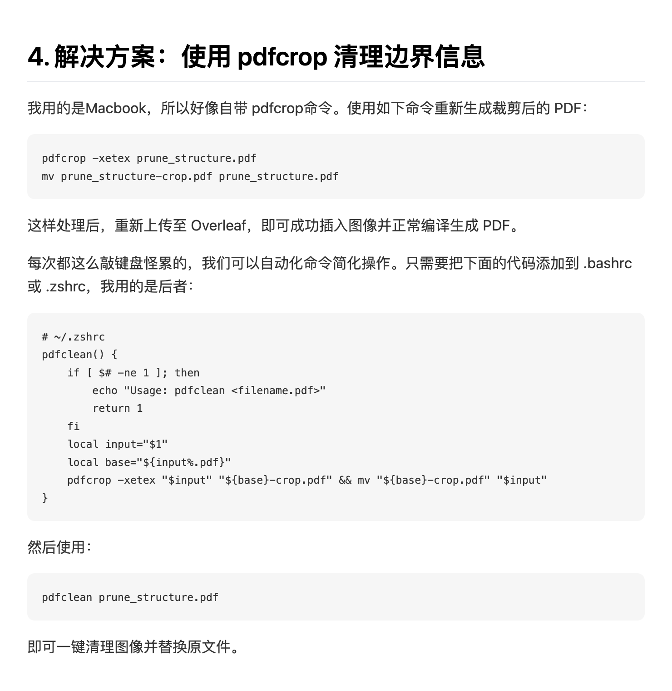

# markdown2rednote
convert your markdown to rednote(小红书)

# Platform
- Macbook

# Dependencies

- npm

# Quick Start

- create a new markdown file, 'my_file.md'

```bash
chmod +x ./md2xhs.sh
./md2xhs.sh my_file.md
```


Output like:
```bash
❯ ./md2xhs.sh my_file.md
将保存图片到: my_file/
安装必要的依赖...

up to date, audited 101 packages in 3s

8 packages are looking for funding
  run `npm fund` for details

found 0 vulnerabilities
将 Markdown 转换为小红书风格图片...
已加载样式: xiaohongshu.css
将Markdown分割成 5 个部分
启动浏览器...
处理第 1/5 部分...
已生成第 1 张图片: my_file/01.png (高度: 507px)
处理第 2/5 部分...
已生成第 2 张图片: my_file/02.png (高度: 474px)
处理第 3/5 部分...
已生成第 3 张图片: my_file/03.png (高度: 892px)
处理第 4/5 部分...
已生成第 4 张图片: my_file/04.png (高度: 760px)
处理第 5/5 部分...
已生成第 5 张图片: my_file/05.png (高度: 718px)
✅ 已将 Markdown 转换为 5 张图片
✅ 完成! 图片已保存到 my_file/ 目录
```
A folder with the same prefix as your_markdown_file.md will be created, and figures will be saved in it.

生成结果可在`my_file_images`中查看





