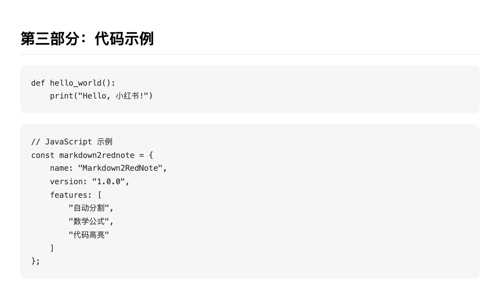

# Markdown2RedNote

一个将 Markdown 文件转换为小红书风格图片的 Mac 应用。

## 功能特点

- 支持将 Markdown 文件转换为多张小红书风格的图片
- 自动分割长内容为适合小红书发布的图片
- 支持自定义样式
- 简单易用的图形界面

## 安装说明

1. 下载最新版本的 [Markdown2RedNote.dmg](https://github.com/marsggbo/markdown2rednote/releases/tag/release) 文件
2. 双击打开 dmg 文件
3. 将 Markdown2RedNote 应用拖到 Applications 文件夹
4. 从 Applications 文件夹启动应用

## 使用教程

### 基本使用

1. 启动应用后，你会看到一个简洁的界面
2. 点击"选择文件"按钮，选择要转换的 Markdown 文件
3. 点击"选择目录"按钮，选择保存图片的位置
4. 点击"开始转换"按钮，等待转换完成
5. 转换完成后，图片将保存在指定的目录中

### 示例

假设你有一个名为 `example.md` 的 Markdown 文件，内容如下：

```markdown
# 小红书笔记示例

## 第一部分：介绍

这是一个示例笔记，展示了如何将 Markdown 转换为小红书风格的图片。

### 特点
- 自动分割长内容
- 保持格式美观
- 支持数学公式
- 支持代码高亮

## 第二部分：数学公式

这是一个行内公式：$E=mc^2$

这是一个块级公式：
$$
\int_{a}^{b} f(x) dx = F(b) - F(a)
$$

## 第三部分：代码示例

```python
def hello_world():
    print("Hello, 小红书!")
```

## 第四部分：总结

使用 Markdown2RedNote 可以轻松将你的 Markdown 笔记转换为小红书风格的图片。

转换后的效果：
- 内容会被自动分割成多张图片
- 每张图片都保持小红书风格的排版
- 数学公式和代码都会正确显示
- 图片会自动保存在你选择的目录中

### 注意事项

1. **文件格式**
   - 确保使用 UTF-8 编码的 Markdown 文件
   - 支持常见的 Markdown 语法
   - 支持数学公式（使用 KaTeX 语法）
   - 支持代码高亮

2. **图片输出**
   - 每张图片会自动调整大小以适应小红书
   - 长内容会自动分割成多张图片
   - 图片会按顺序编号（01.png, 02.png 等）

3. **常见问题**
   - 如果转换失败，请检查：
     - Markdown 文件格式是否正确
     - 输出目录是否有写入权限
     - 文件路径是否包含特殊字符

## 高级功能

### 自定义样式

你可以通过修改 `xiaohongshu.css` 文件来自定义输出图片的样式，包括：
- 字体大小和颜色
- 背景颜色
- 间距和边距
- 代码块样式
- 数学公式样式

### 命令行使用

除了图形界面，你也可以通过命令行使用，使用方式有两种：

1. 使用 node

```bash
# 基本用法
node md2img_browser.js input.md --output output_dir/

# 指定宽度
node md2img_browser.js input.md --output output_dir/ --width 700

# 指定样式
node md2img_browser.js input.md --output output_dir/ --style custom.css
```

- 2. 使用 `md2xhs.sh`

```bash
chmod +x ./md2xhs.sh
./md2xhs.sh my_file.md
```


Output like:
```bash
❯ ./md2xhs.sh example.md 
将保存图片到: example_images/
安装必要的依赖...

up to date, audited 393 packages in 1s

53 packages are looking for funding
  run `npm fund` for details

found 0 vulnerabilities
将 Markdown 转换为小红书风格图片...
已加载样式: xiaohongshu.css
将Markdown分割成 4 个部分
启动浏览器...
处理第 1/4 部分...
已生成第 1 张图片: example_images/01.png (高度: 621px)
处理第 2/4 部分...
已生成第 2 张图片: example_images/02.png (高度: 449px)
处理第 3/4 部分...
已生成第 3 张图片: example_images/03.png (高度: 526px)
处理第 4/4 部分...
已生成第 4 张图片: example_images/04.png (高度: 184px)
✅ 已将 Markdown 转换为 4 张图片
✅ 完成! 图片已保存到 example_images/ 目录
```

生成结果可在`example_images`中查看

- Figure1


- Figure2


- Figure3


- Figure4

